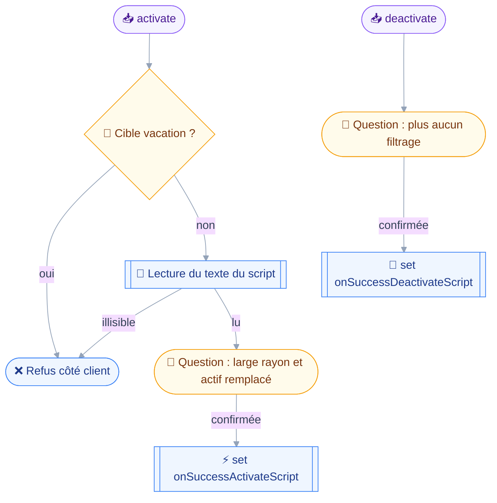
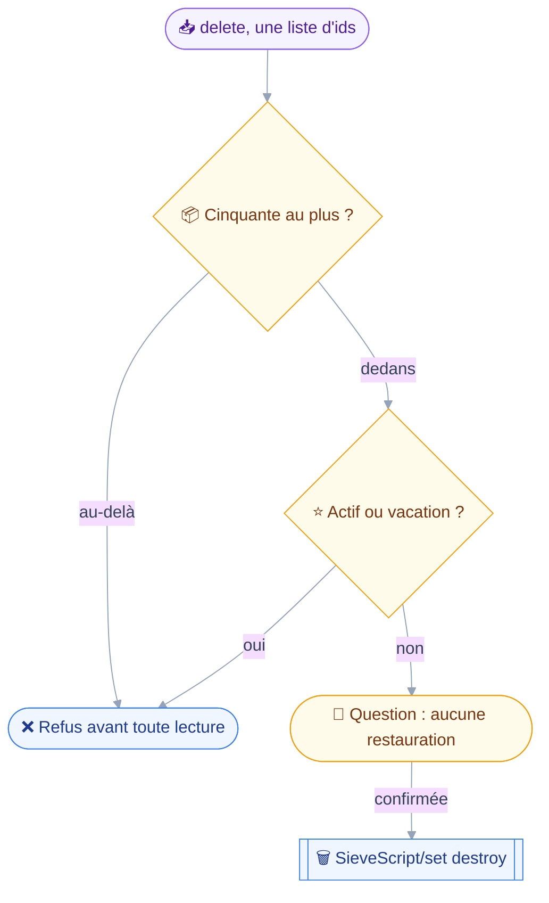
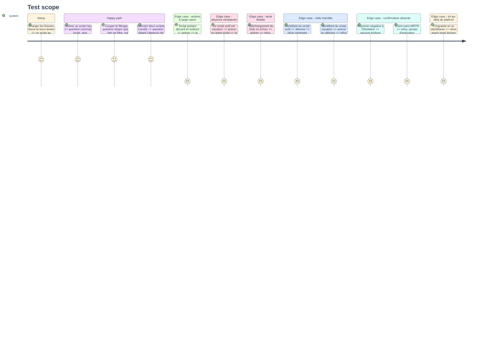

# Instruction — Activer, couper, détruire

Les trois gestes de la phase engagent tout le courrier à venir, et un seul script peut être actif à la fois.
Activer, c'est donc toujours désactiver autre chose, et quand cet autre chose est l'absence, la question doit le dire.

## 🗂️ Architecture projection

> Arbre des fichiers en fin de phase. ✅ créer · ✏️ modifier · ❌ supprimer

```txt
.
├── src
│   └── domains
│       └── sieve
│           ├── edit.ts                           ✏️
│           ├── radius.ts                         ✅
│           └── write.ts                          ✏️
└── tests
    ├── contract
    │   └── sieve-write-guard.test.ts             ✅
    └── unit
        ├── sieve-radius.test.ts                  ✅
        └── sieve-write.test.ts                   ✏️
```

## 🚶 User Journey

Basculer l'état actif, dans un sens comme dans l'autre.



Détruire, où deux refus tombent avant la question.



## 🧪 Test Scope



## 📝 Tasks to do

### `1)` Les actions à large rayon

> Nommer ce qu'un script fait avant qu'il ne le fasse.

1. `src/domains/sieve/radius.ts` : fonction pure prenant un texte Sieve et rendant les actions à large rayon qu'il contient.
2. Ordre de gravité fixe : `discard` d'abord, la perte étant silencieuse et sans corbeille, `redirect` ensuite, le courrier quittant le compte, puis `reject`, `ereject`, `vacation`, `fileinto`.
3. L'analyse est lexicale, commentaires `#` et `/* */` retirés, et elle sur-détecte volontairement : annoncer un `discard` absent coûte une inquiétude, taire celui qui est là coûte du courrier.
4. La fonction ne touche ni au réseau ni au contexte : elle se teste sur des chaînes.

### `2)` `sieve_write`, action `activate`

> Un seul script actif à la fois, donc activer remplace toujours.

1. Branche `activate` du schéma discriminé : un `id`, jamais un lot, jamais un filtre.
2. `classify` rend `destroy` : un `discard` activé perd du courrier sans trace, et c'est la seule perte que le module rend possible.
3. `precheck` : refus si l'identifiant désigne le script `vacation`, le chemin des scripts n'ayant pas à toucher l'absence.
4. `precheck` : lecture du texte par le cache de `script.ts`, et refus quand elle échoue — une activation qu'on ne peut pas décrire ne se fait pas confirmer à l'aveugle.
5. `summarize` : le nom du script, les actions à large rayon dans l'ordre de gravité, et le nom du script que l'activation remplace.
6. Quand le script remplacé est `vacation`, la phrase dit que la réponse d'absence s'éteint — `sieve/set.rs:328` ne rend qu'un seul actif, et `vacation/set.rs:144` fait de cet actif l'état de l'absence.
7. `run` : `SieveScript/set` ne portant que `onSuccessActivateScript`, sans création, sans mise à jour, sans destruction dans le même appel.

### `3)` `sieve_write`, action `deactivate`

> Revenir au traitement neutre sans rien perdre.

1. Branche `deactivate` sans argument : il n'y a qu'un script actif, donc rien à désigner.
2. `classify` rend `destroy`, par symétrie avec l'activation : ce qui bascule l'état du courrier se confirme dans les deux sens.
3. `summarize` : nomme le script qui cesse de filtrer, et dit que l'absence s'éteint quand c'est elle qui était active.
4. `run` : `SieveScript/set` ne portant que `onSuccessDeactivateScript` à vrai.
5. Aucun script n'étant actif, l'appel le dit et n'émet rien.

### `4)` `sieve_write`, action `delete`

> Prendre des identifiants, refuser ce que le serveur laisserait passer.

1. Branche `delete` : `ids`, tableau non vide, aucun filtre, aucun motif de nom.
2. `precheck` : `refuseOversizedBatch(ids, SIEVE_SCRIPTS)` en premier, avant toute lecture.
3. `precheck` : refus si l'un des identifiants est le script actif, en nommant l'activation qui bloque — Stalwart le refuse aussi en `scriptIsActive`, mais après la question.
4. `precheck` : refus si l'un des identifiants est le script `vacation`. C'est le seul endroit du module où le client est la seule garde : `sieve/set.rs:329-351` ne contrôle que la condition du script actif.
5. `summarize` : nomme les scripts détruits et dit qu'aucune restauration n'existe.
6. `run` : `SieveScript/set` portant `destroy`, et les refus rendus par identifiant.

### `5)` Le contrat d'écriture

> Prouver que rien n'active ni ne détruit sans garde.

1. `tests/contract/sieve-write-guard.test.ts` sur le patron de `files-write-guard.test.ts` : parcours du manifeste, arguments minimaux dérivés du schéma.
2. Table écrite à la main des arguments atteignant chaque branche destructrice, plus un test d'exhaustivité qui tombe si un outil déclare `destroy` sans y figurer.
3. Aucun `SieveScript/set` émis ne porte `isActive` dans une création ou une mise à jour, sur chacun des chemins qui y mènent.
4. Le chemin `store` n'émet jamais `onSuccessActivateScript` ni `onSuccessDeactivateScript` ; les chemins `activate` et `deactivate` n'émettent jamais de création, de mise à jour ni de destruction.
5. Aucune écriture ni destruction émise ne vise le script nommé `vacation`, quel que soit le chemin.
6. Une action non confirmée n'émet aucune écriture : l'assertion porte sur toutes les méthodes émises, rien hors des `/get` et `/query`.
7. Sans élicitation, l'outil refuse au lieu de s'exécuter.
8. Un test lit les sources pour vérifier qu'un seul module émet `SieveScript/set` avec `destroy` et qu'un seul écrit les deux arguments d'activation.

### `6)` Couverture unitaire

> Le rayon et les refus, sans serveur.

1. `tests/unit/sieve-radius.test.ts` : détection dans un script portant les six actions, absence de détection dans un script neutre, mot en commentaire ignoré, ordre de gravité respecté.
2. `tests/unit/sieve-write.test.ts` étendu : phrase d'activation nommant le script remplacé, phrase disant l'extinction de l'absence, refus sur script actif, refus sur script `vacation`, refus au-delà du plafond.

## ✅ Test acceptance criteria

| Tâche | Critère d'acceptation |
| --- | --- |
| 1.2 | Un script portant `discard` et `fileinto` les annonce dans cet ordre |
| 1.3 | Le mot `discard` en commentaire est ignoré par la détection |
| 2.4 | Un texte de script illisible fait refuser l'activation avant toute question |
| 2.6 | Remplacer le script `vacation` actif fait dire à la question que l'absence s'éteint |
| 2.7 | Un appel d'activation n'émet ni création, ni mise à jour, ni destruction |
| 3.5 | Sans script actif, couper le filtrage n'émet aucune méthode |
| 4.2 | Cinquante et un identifiants sont refusés avant toute lecture |
| 4.3 | L'identifiant du script actif fait refuser la destruction en nommant l'activation |
| 4.4 | L'identifiant du script `vacation` fait refuser la destruction côté client |
| 5.3 | Un `isActive` écrit dans une création ou une mise à jour fait tomber le contrat |
| 5.6 | Une confirmation refusée n'émet aucune méthode hors `/get` et `/query` |
| 5.8 | Un second module émettant un argument d'activation fait tomber le contrat |
