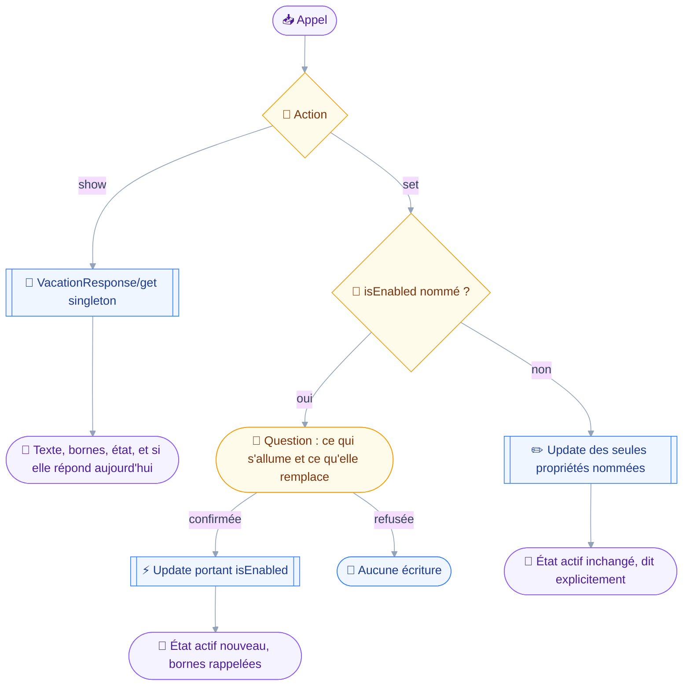
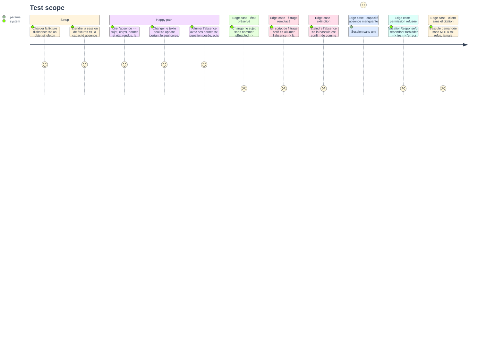

# Instruction — Poser et lever une absence

L'absence est un objet singleton, et son état actif est le même que celui du script `vacation`.
L'allumer désactive donc le script qui filtrait, et c'est la seule conséquence que la confirmation doit absolument nommer.

## 🗂️ Architecture projection

> Arbre des fichiers en fin de phase. ✅ créer · ✏️ modifier · ❌ supprimer

```txt
.
├── src
│   └── domains
│       └── sieve
│           ├── index.ts                          ✏️
│           └── vacation.ts                       ✅
└── tests
    ├── contract
    │   └── vacation-guard.test.ts                ✅
    ├── fixtures
    │   └── sieve.ts                              ✏️
    └── unit
        └── sieve-vacation.test.ts                ✅
```

## 🚶 User Journey



## 🧪 Test Scope



## 📝 Tasks to do

### `1)` `vacation_manage`, action `show`

> Rendre un état qui ne se devine pas.

1. Schéma discriminé sur `action`, branche `show` sans argument : l'objet est un singleton, il n'y a rien à désigner.
2. `run` : `VacationResponse/get` sur l'identifiant `singleton`, seul identifiant que le serveur accepte.
3. Le rendu porte le sujet, le corps texte, le corps HTML, les deux bornes et l'état actif.
4. Il dit en une ligne si l'absence répond aujourd'hui, en croisant l'état actif et les bornes : le script généré porte les dates — `vacation/set.rs:330` — donc active hors fenêtre ne veut pas dire répondant.
5. Une absence sans borne est dite sans fin plutôt que rendue avec deux champs vides.

### `2)` `vacation_manage`, action `set`

> Écrire ce que l'appel nomme, rien de plus.

1. Branche `set` : sujet, corps texte, corps HTML, borne de début, borne de fin, état actif, toutes optionnelles, chacune acceptant `null` pour effacer.
2. Le schéma distingue l'absence d'une clé de sa valeur nulle : absente, la propriété n'est pas écrite ; nulle, elle est effacée — `vacation/set.rs:214-218`.
3. Les plafonds du serveur sont portés par le schéma : cinq cent douze caractères pour le sujet, deux mille quarante-huit pour chaque corps.
4. `isEnabled` n'est écrit que si l'appel le nomme. Le serveur le préserve — `vacation/set.rs:144` l'initialise depuis le script actif courant, et seule une propriété explicite le change.
5. `run` : `VacationResponse/set` portant un seul `update` sur `singleton`. Ni `create` ni `destroy` ne sont jamais émis, le serveur les refusant tous deux en `singleton`.

### `3)` Les deux classes de l'absence

> Ce qui fait partir des messages n'est pas ce qui change un texte.

1. `classes: ["draft", "send"]`, `classify` rendant `send` dès que `isEnabled` figure dans les arguments, `draft` sinon.
2. Le sens est celui du projet : régler l'absence ne perd rien mais fait partir des messages vers des tiers, là où l'activation d'un script peut perdre du courrier.
3. La bascule est confirmée dans les deux sens : croire une absence posée alors qu'elle est éteinte est le même défaut que l'inverse.
4. `summarize` : nomme l'état visé, rappelle les bornes, et désigne sans le nommer le script de filtrage qui cesse d'être actif — `vacation/set.rs:281-283` désactive les autres scripts quand l'absence s'allume, mais lire lequel exigerait un `SieveScript/get` hors de la capacité de ce manifeste.
5. Le compte rendu d'un appel classé `draft` dit explicitement que l'état actif n'a pas bougé.

### `4)` Le manifeste de l'absence

> Le troisième manifeste reçoit son unique outil.

1. `tools: [vacationManage]` dans `sieveVacationDomain`, ouvert vide à la phase 1.
2. Rien d'autre ne bouge : `ALL_DOMAINS` le porte déjà.

### `5)` Le contrat de l'absence

> Prouver que l'état actif ne bouge que sur demande.

1. `tests/contract/vacation-guard.test.ts` : parcours du manifeste, arguments minimaux dérivés du schéma.
2. Aucun `VacationResponse/set` émis ne porte `isEnabled` quand l'appel ne l'a pas nommé, sur chacun des chemins qui y mènent.
3. Aucun `VacationResponse/set` émis ne porte de `create` ni de `destroy`.
4. Un appel nommant `isEnabled` sans élicitation refuse au lieu de s'exécuter ; une confirmation refusée n'émet aucune écriture.
5. Aucune méthode `SieveScript/*` n'est émise par ce manifeste : l'absence a son propre chemin, et le prendre autrement serait refusé par le serveur.
6. Gating : sans `urn:ietf:params:jmap:vacationresponse`, le manifeste n'enregistre rien et `report.skipped` nomme la capacité ; avec elle seule, l'outil est enregistré même sans Sieve.

### `6)` Couverture unitaire

> Le rendu de l'état et la construction du patch, sans serveur.

1. `tests/unit/sieve-vacation.test.ts` : rendu d'une absence active dans sa fenêtre, active hors fenêtre, éteinte, sans borne.
2. Construction du patch pour chacun des trois cas : propriété nommée, propriété nulle, propriété absente.
3. Phrase de confirmation désignant sans le nommer le script de filtrage remplacé, et phrase d'extinction.
4. `tests/fixtures/sieve.ts` gagne l'objet `VacationResponse` et ses variantes.

## ✅ Test acceptance criteria

| Tâche | Critère d'acceptation |
| --- | --- |
| 1.4 | Une absence active dont la fenêtre est passée est rendue comme ne répondant pas |
| 1.5 | Une absence sans borne est dite sans fin, jamais rendue avec deux champs vides |
| 2.2 | Une propriété absente n'est pas écrite, une propriété nulle est effacée |
| 2.4 | Un changement de sujet seul émet un update sans `isEnabled` |
| 2.5 | Aucun `create` ni `destroy` n'est émis sur `VacationResponse` |
| 3.1 | Nommer `isEnabled` classe l'appel `send`, l'omettre le classe `draft` |
| 3.3 | Éteindre l'absence passe par la même confirmation que l'allumer |
| 3.4 | La question d'allumage désigne sans le nommer le script de filtrage qui cesse d'être actif |
| 5.5 | Une méthode `SieveScript/*` émise par ce manifeste fait tomber le contrat |
| 5.6 | Une session annonçant l'absence sans Sieve enregistre tout de même l'outil |
