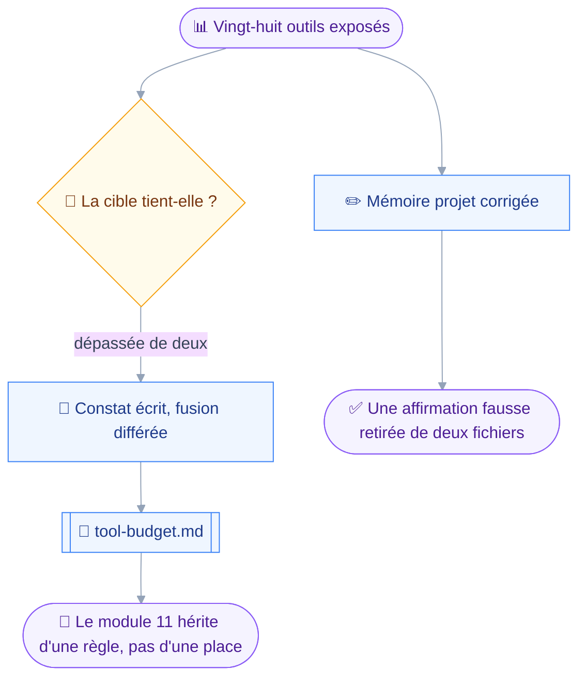
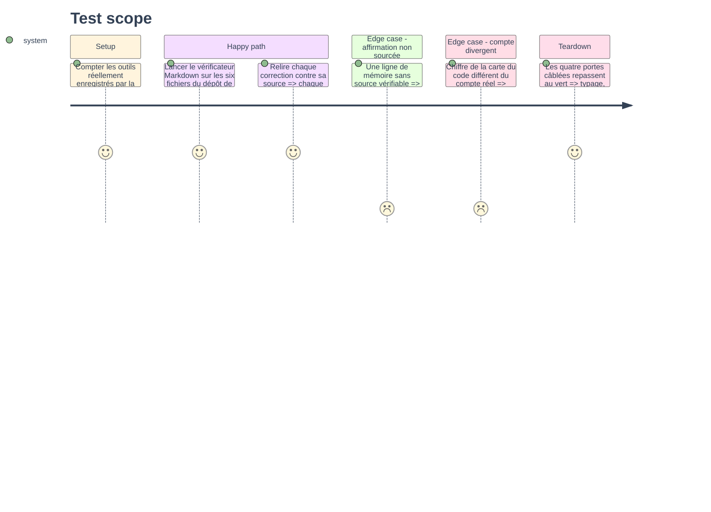

# Instruction — Budget d'outils, mémoire projet et deux corrections

Phase sans code de production.
Elle constate le dépassement de la cible d'outils au lieu de le masquer, et retire des documents une affirmation fausse que deux d'entre eux répètent.

## 🗂️ Architecture projection

> Arbre des fichiers en fin de phase. ✅ créer · ✏️ modifier · ❌ supprimer

```txt
.
├── README.md                                     ✏️
└── aidd_docs
    ├── ROADMAP.md                                ✏️
    └── memory
        ├── architecture.md                       ✏️
        ├── codebase-map.md                       ✏️
        ├── external
        │   └── stalwart-jmap.md                  ✏️
        ├── internal
        │   └── tool-budget.md                    ✏️
        └── testing.md                            ✏️
```

## 🚶 User Journey



## 🧪 Test Scope



## 📝 Tasks to do

### `1)` La correction qui compte

> Une affirmation fausse, répétée dans deux fichiers, sur laquelle un critère d'acceptation reposait.

1. `aidd_docs/memory/external/stalwart-jmap.md:265` affirme que `isEnabled` retombe à faux dès qu'une propriété de l'absence change. C'est faux.
2. La remplacer par ce que le code fait : `vacation/set.rs:144` initialise l'état depuis le script actif courant, et seule une propriété `isEnabled` explicite le change — `vacation/set.rs:186-191`.
3. `aidd_docs/ROADMAP.md:231` porte la même affirmation, et le module 10 y nomme encore trois outils comme plan initial. Corriger l'affirmation, et renvoyer le compte d'outils au plan plutôt qu'au PRD.
4. Ajouter la conséquence pratique : réécrire `isEnabled` à chaque changement de texte fondrait les deux gestes que le module sépare.

### `2)` Ce que la mémoire ignorait de Sieve

> Trois faits que la lecture des sources a établis et qu'aucun document ne portait.

1. Le troisième chemin d'activation : écrire la propriété `isActive` active un script, le serveur la retraduisant en `onSuccessActivateScript` — `sieve/set.rs:482-484` et `:358-368`.
2. L'exclusivité : un seul script est actif à la fois — `sieve/set.rs:328` — donc activer un filtre éteint l'absence, et allumer l'absence désactive le filtre — `vacation/set.rs:281-283`.
3. Le nom `vacation` est réservé à l'écriture et à la création — `sieve/set.rs:416-424` et `:443-448` — mais sa destruction par le chemin des scripts n'est gardée par rien.
4. Les codes du fil diffèrent de ceux de la RFC : `invalidScript` et `scriptIsActive` là où RFC 9661 nomme `invalidSieve` et `sieveIsActive`.
5. Compléter la section Sieve avec les propriétés réellement rendues, les deux filtres et les deux comparateurs honorés, et le fait que Stalwart lève une vraie erreur au-delà, contrairement au domaine des fichiers.

### `3)` Le budget dépassé, écrit tel quel

> Constater plutôt qu'arrondir.

1. `internal/tool-budget.md` : le compte passe à vingt-huit pour une cible de vingt-six, relevé sur le rapport de composition.
2. Écrire pourquoi la place n'a pas suffi : deux manifestes et deux outils sont incompatibles avec l'interdiction de fondre une lecture et une destruction sous un nom.
3. Écrire ce que le dépassement coûte réellement : le seuil de dégradation observé est trente, et le gating borne ce qu'un client donné voit.
4. Nommer les candidats à la fusion pour le module 11, sans les arbitrer : deux verbes voisins de même classe, sur des identifiants, dans un domaine déjà livré.
5. Rappeler la contrainte qui borne l'exercice : retirer un outil déjà exposé est une rupture semver, donc une fusion se décide avant publication ou pas du tout.

### `4)` La carte du code

> Trois manifestes de plus, trois outils de plus.

1. Note de tête : vingt-huit outils, dont trois pour Sieve et l'absence.
2. Table des manifestes : `sieveDomain`, `sieveWritingDomain` et `sieveVacationDomain`, avec leurs capacités et leurs outils.
3. Dire pourquoi le domaine se scinde sur deux axes à la fois : la lecture séparée de l'écriture comme partout, et l'absence séparée du filtrage parce que deux permissions Stalwart distinctes les portent.
4. Nommer les modules partagés : `script.ts` pour le rendu et la résolution, `edit.ts` pour les arguments d'écriture, `radius.ts` pour les actions à large rayon.

### `5)` L'architecture

> Ce que ce module ajoute aux décisions structurantes et aux pièges.

1. Une section sur ce qu'une activation traverse : la lecture obligatoire du texte, la détection du rayon, et le script que l'activation remplace.
2. Le texte d'un script traverse la conversation là où les octets d'un fichier ne le font pas, et la raison en est écrite : c'est ce que l'utilisateur rédige et relit.
3. Le `confirmWhen` du stockage : écraser le script actif change le courrier immédiatement, ce que la classe `draft` n'annonce pas.
4. Ajouter aux pièges : le troisième chemin d'activation, l'exclusivité mutuelle du filtrage et de l'absence, la destruction du script `vacation` que seul le client garde, et les codes d'erreur qui diffèrent de la RFC.

### `6)` Les tests et la vitrine

> Le compte de tests, la table des contrats, et la page publique.

1. Note de tête de `testing.md` : nombre de tests, de fichiers et de contrats, après mesure réelle et non par estimation.
2. Ajouter les trois contrats à la table, avec l'invariant que chacun tient.
3. Décrire l'assertion propre au domaine : aucune création ni mise à jour émise ne porte `isActive`, et aucune écriture ne vise le script `vacation`.
4. `README.md` : ajouter les trois outils à la table publique avec leur classe, et retirer Sieve de la liste des domaines qui n'enregistrent rien.
5. Le README reste exempté du contrat Markdown : le vérificateur s'y lance avec `--ignore=FM001,EMO001`.

### `7)` Vérification

> Rien n'est fini tant que les portes ne sont pas vertes.

1. `node scripts/check-markdown.js` du skill `markdown-style` sur les six fichiers Markdown du dépôt de docs.
2. Les quatre portes câblées : `pnpm typecheck`, `pnpm lint`, `pnpm test`, `pnpm build`, sous Node 24.
3. Le compte d'outils est relevé sur le rapport de composition, jamais compté à la main dans les fichiers sources.

## ✅ Test acceptance criteria

| Tâche | Critère d'acceptation |
| --- | --- |
| 1.1 | Aucune affirmation disant que `isEnabled` retombe seul ne subsiste dans le dépôt |
| 1.3 | La ROADMAP ne présente plus trois outils comme un compte arrêté |
| 2.1 | La mémoire nomme les trois chemins d'activation, pas deux |
| 2.2 | La mémoire dit que filtrage et absence ne peuvent pas être actifs ensemble |
| 2.4 | Les codes cités sont ceux du fil, et l'écart avec la RFC est nommé |
| 3.1 | Le chiffre de `tool-budget.md` correspond au rapport de composition |
| 3.4 | Les candidats à la fusion sont nommés sans être arbitrés |
| 4.1 | Le nombre d'outils de la carte du code est celui que la composition enregistre |
| 6.1 | Le nombre de tests de `testing.md` provient d'une exécution |
| 7.1 | `check-markdown.js` sort à zéro sur les six fichiers du dépôt de docs |
| 7.2 | Les quatre portes câblées passent au vert après les modifications |
