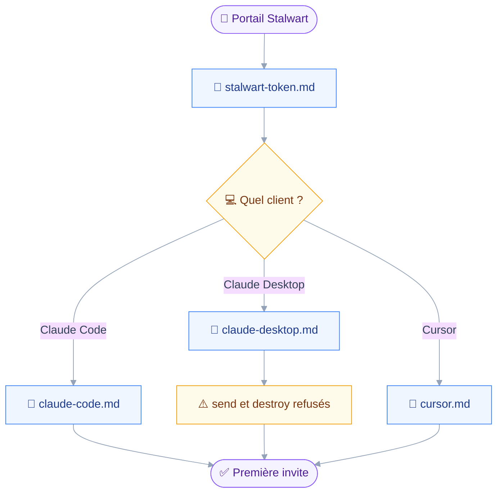
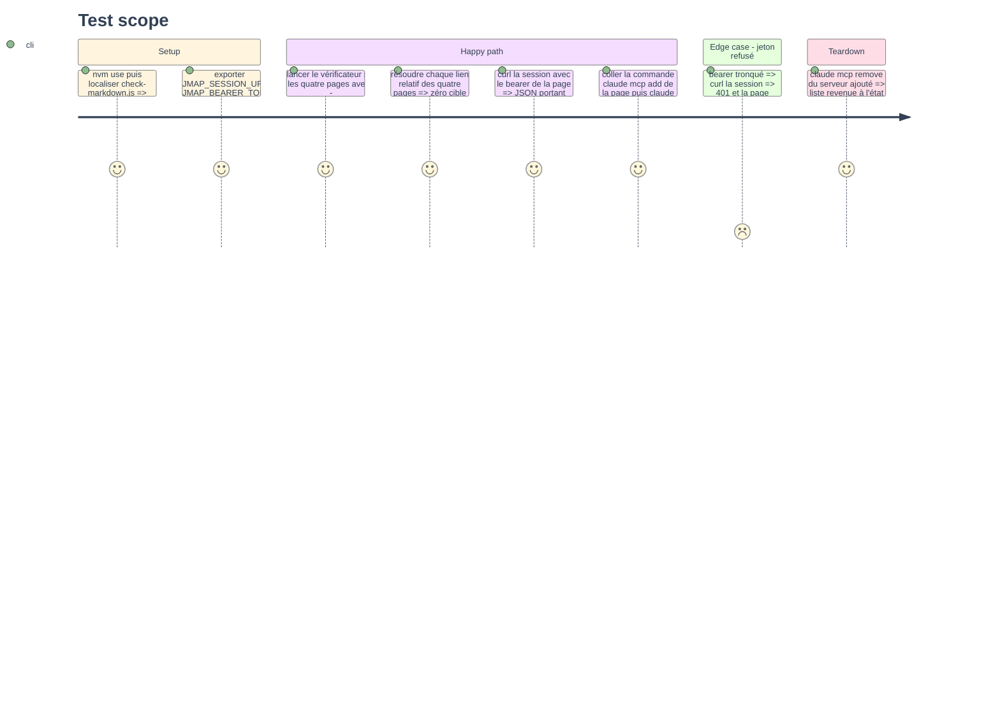

# Instruction — Le jeton et la mise en route par client

Rien ne s'appelle avant qu'un jeton existe et qu'un client connaisse le serveur.
Cette phase écrit les quatre pages de ce chemin, et la première n'est affirmée qu'après un `curl` réel : la doc de Stalwart et son code se contredisent sur ce qu'une clé API peut authentifier.

## 🗂️ Architecture projection

> Arbre des fichiers en fin de phase. ✅ créer · ✏️ modifier · ❌ supprimer

```txt
.
└── docs
    └── getting-started
        ├── stalwart-token.md                    ✅
        ├── claude-code.md                       ✅
        ├── claude-desktop.md                    ✅
        └── cursor.md                            ✅
```

## 🚶 User Journey



## 🧪 Test Scope



## 📝 Tasks to do

### `1)` La page du jeton

> Dire quel bearer Stalwart accepte sur JMAP, comment l'obtenir, et comment le vérifier avant d'aller plus loin.

1. Créer `docs/getting-started/stalwart-token.md`, en anglais, sans front-matter, H1 puis H2 sans emoji.
2. Ouvrir sur les deux formes de bearer que `authentication.rs:300-311` accepte : une clé API préfixée `API_`, sinon un jeton d'accès OAuth.
3. Écarter le mot de passe d'application en une phrase : il voyage en Basic, et le serveur MCP n'envoie que `Authorization: Bearer`.
4. Décrire la création d'une clé API depuis le portail en libre-service, menu « API Keys », permissions en `Inherit`, expiration au choix.
5. Nommer la contradiction avec la doc officielle et dire ce qui la tranche : le `curl` de l'étape 6, à faire avant de configurer quoi que ce soit.
6. Donner le `curl` de vérification sur l'URL de session et le fragment de réponse attendu, `capabilities` et `primaryAccounts`.
7. Écrire le repli OAuth : flux d'appareil sur `/auth/device` puis `/auth/token`, jeton d'une heure par défaut, `accessTokenExpiry` à rallonger dans Settings › Authentication › OIDC Provider.
8. Fermer sur le lieu du jeton : variable `JMAP_BEARER_TOKEN` ou fichier de configuration, jamais un argument de ligne de commande.

### `2)` La page Claude Code

> Un enregistrement en une commande, une vérification, une première invite.

1. Créer `docs/getting-started/claude-code.md`.
2. Donner la commande complète : `claude mcp add --transport stdio --scope user --env JMAP_SESSION_URL=… --env JMAP_BEARER_TOKEN=… jmap -- npx -y @bryanberger/jmap-mcp`.
3. Expliquer `--scope` en trois lignes : `local` par défaut, `project` partagé dans `.mcp.json`, `user` pour toutes les sessions.
4. Montrer la vérification : `claude mcp list`, `claude mcp get jmap`, `/mcp` dans la session, et la ligne stderr `jmap-mcp: N tools registered…`.
5. Donner une première invite en lecture et une en écriture, en disant que la seconde pose une question avant d'agir.
6. Renvoyer vers la page de la politique d'écriture pour ce que la question contient.

### `3)` La page Claude Desktop

> Le fichier de configuration, et la phrase exacte que reçoit quiconque tente un envoi.

1. Créer `docs/getting-started/claude-desktop.md`.
2. Donner les deux chemins du fichier, macOS et Windows, et le bloc `mcpServers` avec `command`, `args`, `env`.
3. Dire de redémarrer l'application, puis où lire stderr : `~/Library/Logs/Claude/mcp-server-jmap.log`.
4. Citer tel quel le refus de `src/registry/compose.ts` pour un client sans élicitation, et dire qu'il vaut pour tout `send` et tout `destroy`.
5. Proposer `policy.send: deny` et `policy.destroy: deny` dans le fichier de configuration, avec l'effet : les outils entièrement refusés quittent la liste au lieu d'échouer.
6. Marquer la confiance : le constat vient du spike du 2026-08-30, une version ultérieure de l'application peut le rendre faux.

### `4)` La page Cursor

> Le même fichier JSON, à deux endroits possibles.

1. Créer `docs/getting-started/cursor.md`.
2. Donner `.cursor/mcp.json` pour un projet et `~/.cursor/mcp.json` pour la machine, même forme que Claude Desktop.
3. Dire que l'élicitation est prise en charge, donc que les confirmations fonctionnent, et renvoyer vers la page de la politique.

### `5)` La vérification

> Aucune page n'est affirmée sans passer le vérificateur, et la page du jeton sans passer le serveur.

1. Lancer `node ~/.claude/skills/markdown-style/scripts/check-markdown.js <page> --ignore=FM001,EMO001` sur chaque page.
2. Résoudre chaque lien relatif par un script d'une ligne, et corriger toute cible absente.
3. Exécuter le `curl` de la page du jeton avec le jeton réel du shell, et ne garder la page que si la réponse porte `capabilities`.
4. Si le shell n'a pas le jeton, écrire la page telle quelle et le dire dans le compte rendu : la phase n'est alors pas close.

## ✅ Test acceptance criteria

| Task | Acceptance criteria |
| --- | --- |
| 1 | La page nomme les deux bearers acceptés, écarte le mot de passe d'application, et son `curl` reçoit un JSON portant `capabilities` sur le serveur réel |
| 1 | La contradiction entre la doc et le code de Stalwart est écrite noir sur blanc, avec le `curl` comme arbitre |
| 2 | La commande `claude mcp add` de la page, collée telle quelle, fait apparaître le serveur dans `claude mcp list` |
| 3 | Le refus cité est identique, à l'octet près, à la chaîne de `src/registry/compose.ts` |
| 3 | La page donne le chemin du fichier sur macOS et Windows, et celui du journal stderr |
| 4 | La page donne les deux emplacements de `mcp.json` et dit que la confirmation fonctionne |
| 5 | Le vérificateur ne rend aucune erreur sur les quatre pages avec `--ignore=FM001,EMO001`, et aucun lien relatif ne pointe dans le vide |
