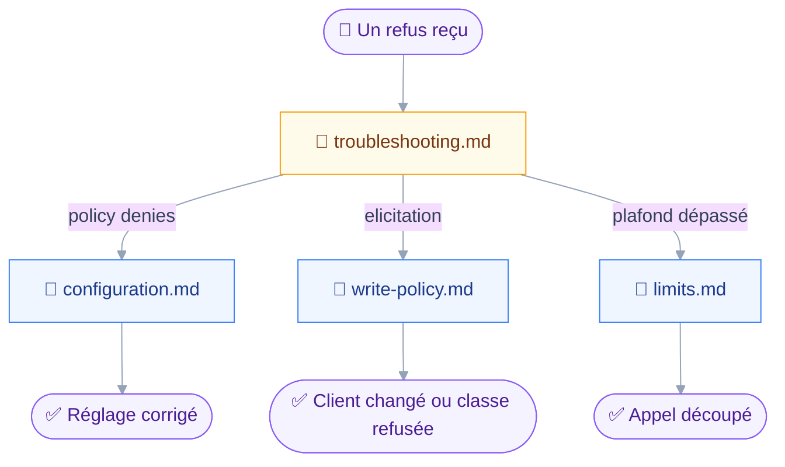
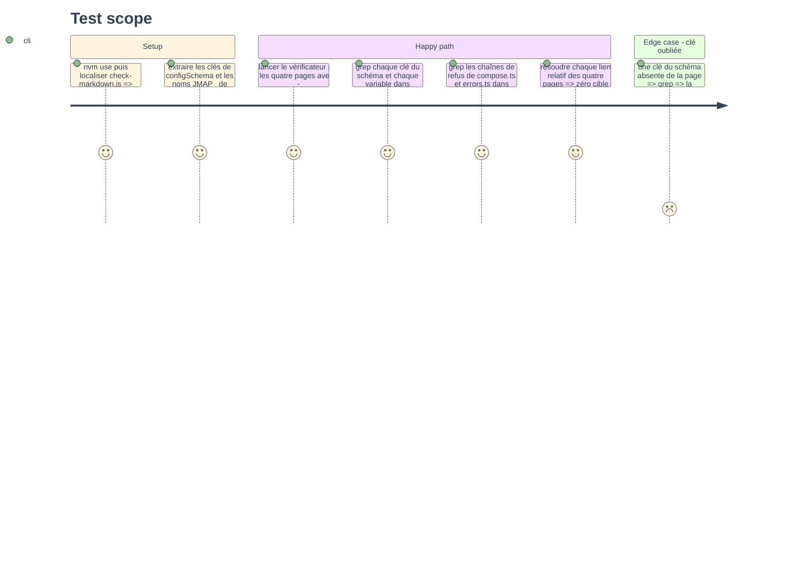

# Instruction — La configuration, la politique d'écriture, les limites et le dépannage

Le README documente les variables d'environnement et tait le fichier, dont la clé `policy` n'est écrite nulle part.
Cette phase écrit la référence complète de la configuration, explique ce qu'un appel traverse avant d'agir, chiffre chaque plafond, et donne à chaque refus sa cause.

## 🗂️ Architecture projection

> Arbre des fichiers en fin de phase. ✅ créer · ✏️ modifier · ❌ supprimer

```txt
.
└── docs
    ├── explanation
    │   └── write-policy.md                      ✅
    ├── reference
    │   ├── configuration.md                     ✅
    │   └── limits.md                            ✅
    └── troubleshooting.md                       ✅
```

## 🚶 User Journey



## 🧪 Test Scope



## 📝 Tasks to do

### `1)` La référence de configuration

> Chaque clé, sa variable, son défaut, et qui gagne quand les deux sont posées.

1. Créer `docs/reference/configuration.md`.
2. Ouvrir sur les deux sources et leur préséance : la variable d'environnement l'emporte sur `~/.config/jmap-mcp/config.json` — `src/config/load.ts`.
3. Dresser la table clé par clé depuis `src/config/schema.ts` : `sessionUrl`, `bearerToken`, `accountId`, `policy.read|draft|send|destroy`, `recipients.scope`, `recipients.allow`, `files.localRoot`, `files.maxDownloadSize`, `bulkConfirmAbove`, avec type, défaut, variable `JMAP_*` quand elle existe.
4. Dire lesquelles n'ont pas de variable : `policy`, `files.localRoot`, `files.maxDownloadSize`, et pourquoi le fichier est alors obligatoire.
5. Donner un fichier complet en exemple, puis trois variantes : lecture seule, Claude Desktop, périmètre `contacts` avec une liste `allow`.
6. Écrire les contraintes que le schéma tient : `localRoot` absolu et jamais la racine du disque, `bulkConfirmAbove` entier positif, entrées `allow` sous la forme `user@example.com` ou `@example.com`.

### `2)` L'explication de la politique d'écriture

> Ce qu'un appel traverse avant d'agir, et pourquoi une classe ne dit jamais combien.

1. Créer `docs/explanation/write-policy.md`.
2. Définir les quatre classes et les trois niveaux, avec les défauts de `src/config/policy.ts`.
3. Dessiner l'ordre `precheck → confirmWhen → elicitation → run` en flèches texte, et dire ce que chaque étape refuse.
4. Expliquer la confirmation : sa forme `summarize` puis « This is a <class> operation. Proceed? », la capacité `elicitation` qu'elle exige, et ce qu'il advient sans elle.
5. Donner les cas où un `draft` demande quand même : un déplacement au-delà de `bulkConfirmAbove`, la réécriture du script Sieve actif.
6. Expliquer le périmètre des destinataires : résolu au démarrage, fermé en cas d'échec, `contacts_search` qui marque dedans ou dehors, une fiche créée n'y entrant qu'au redémarrage.
7. Dire ce que le client voit à l'initialisation : les `instructions` de `src/registry/instructions.ts` nomment le compte, les domaines et les effets des classes atteignables.
8. Fermer sur les deux relectures de classe hors nom d'outil : `calendar_delete` sous `send: deny`, `vacation_manage` sous `destroy: deny`.

### `3)` Les limites

> Chaque nombre du code, avec sa raison et l'outil qu'il borne.

1. Créer `docs/reference/limits.md`.
2. Relever chaque plafond dans `src/` et le citer avec son fichier : cinquante identifiants par appel, seuil `bulkConfirmAbove` à vingt, pages de un à cent, cinq messages par `mail_read` et huit mille octets de corps, vingt fiches et vingt événements par lecture, cent mégaoctets par téléchargement, cinq mille fiches pour le périmètre, un an de fenêtre de disponibilité, cinq cent douze et deux mille quarante-huit caractères pour l'absence.
3. Ajouter les limites que le serveur pose et que l'appel ne voit pas : dix bénéficiaires par objet partagé, tri des fiches par date de création seule.
4. Dire pour chacune ce que fait un appel qui la dépasse : refus avant toute requête, ou question.

### `4)` Le dépannage

> Symptôme, cause, remède, dans cet ordre et sans détour par le code.

1. Créer `docs/troubleshooting.md` sous la forme d'une table symptôme → cause → remède, un H2 par famille.
2. Démarrage : les deux messages de `src/jmap/errors.ts`, credentials refusées et serveur injoignable, et la ligne stderr `jmap-mcp: N tools registered, N domains skipped, N tools denied by policy.`
3. Outils absents : capacité non annoncée par le serveur, ou classe entièrement refusée par `policy`.
4. Refus à l'appel : citer tel quel le refus par politique et le refus sans élicitation de `src/registry/compose.ts`, le refus hors périmètre, le refus sans `files.localRoot`.
5. Où lire stderr par client : `claude mcp get`, le journal `mcp-server-<nom>.log` de Claude Desktop, la sortie MCP de Cursor.
6. Renvoyer vers la page de configuration ou de politique à chaque remède qui en relève.

### `5)` La vérification

> Le vérificateur d'abord, puis deux grep qui tiennent la référence honnête.

1. Lancer le vérificateur avec `--ignore=FM001,EMO001` sur les quatre pages.
2. Extraire les clés de `configSchema` et les noms `JMAP_*` de `load.ts`, et vérifier par grep que chacun figure dans `configuration.md`.
3. Extraire les chaînes `Refused:` de `compose.ts` et les deux messages de `errors.ts`, et vérifier par grep qu'ils figurent dans `troubleshooting.md`.
4. Résoudre chaque lien relatif des quatre pages.

## ✅ Test acceptance criteria

| Task | Acceptance criteria |
| --- | --- |
| 1 | Chaque clé de `configSchema` et chaque variable `JMAP_*` de `load.ts` apparaît dans la page, avec son défaut et la préséance de l'environnement |
| 1 | La clé `policy` est documentée avec ses quatre classes et ses trois niveaux, pour la première fois hors du code |
| 2 | La page nomme l'ordre des quatre étapes et cite la forme de la question de confirmation |
| 2 | Les deux cas où un `draft` demande quand même sont écrits, et les deux relectures de classe hors nom d'outil aussi |
| 3 | Chaque nombre de la page est accompagné du fichier de `src/` ou de Stalwart qui le pose |
| 4 | Chaque refus cité est identique, à l'octet près, à la chaîne du code qui l'émet |
| 5 | Le vérificateur ne rend aucune erreur sur les quatre pages, et les deux grep ne trouvent aucune absence |
