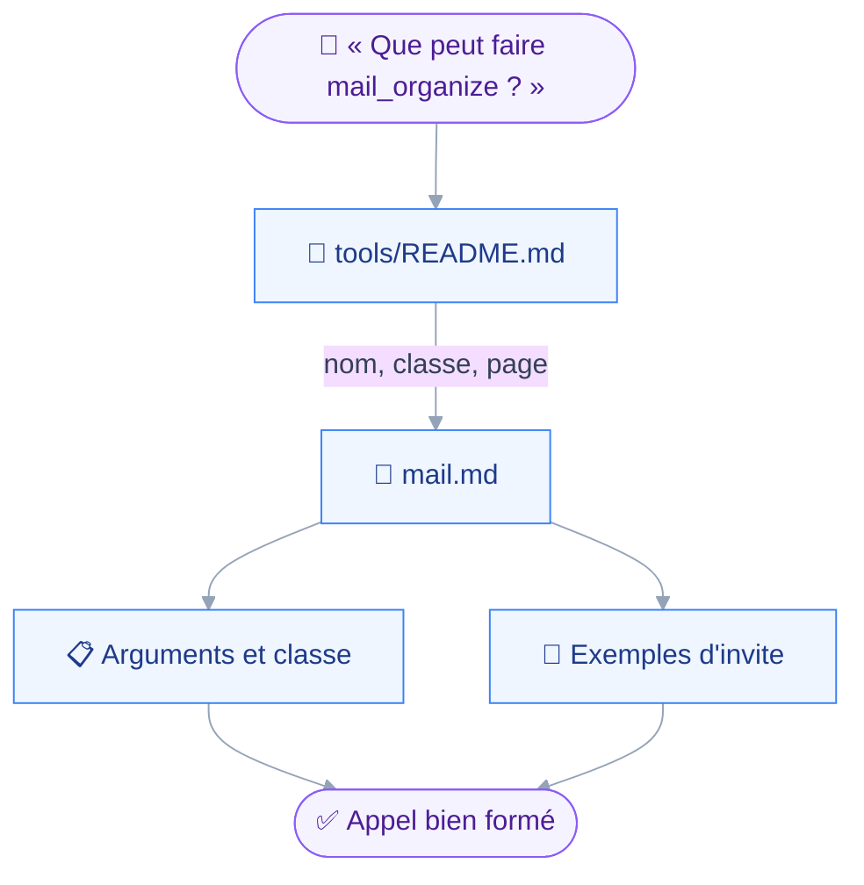
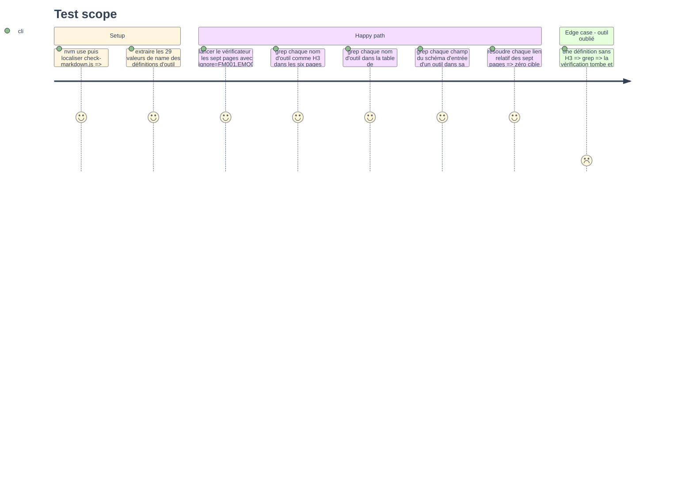

# Instruction — La référence des vingt-neuf outils, domaine par domaine

Le README liste les outils en une table et les décrit en prose ; aucun argument n'y est nommé, aucune invite n'y est montrée.
Cette phase écrit une page par domaine, un H3 par outil, et tient le compte par un grep contre les sources plutôt que par une relecture.

## 🗂️ Architecture projection

> Arbre des fichiers en fin de phase. ✅ créer · ✏️ modifier · ❌ supprimer

```txt
.
└── docs
    └── reference
        └── tools
            ├── README.md                        ✅
            ├── mail.md                          ✅
            ├── contacts.md                      ✅
            ├── calendar.md                      ✅
            ├── files.md                         ✅
            ├── sieve.md                         ✅
            └── sharing.md                       ✅
```

## 🚶 User Journey



## 🧪 Test Scope



## 📝 Tasks to do

### `1)` Le gabarit d'une section d'outil

> La même forme pour vingt-neuf outils, pour que le lecteur sache où regarder.

1. Fixer l'ordre d'une section : une phrase de but reprise de la description, la classe et l'argument qui la fait basculer, la table des arguments, ce qui refuse ou demande, la pagination, deux invites en exemple.
2. Tenir la table des arguments sur quatre colonnes : nom, type, requis, sens ; les contraintes entre arguments en une phrase sous la table.
3. Rédiger chaque invite comme une phrase qu'un utilisateur dirait, jamais comme un appel JSON, et la borner à ce que la description promet.
4. Nommer sous chaque outil d'écriture ce que la question de confirmation contient, en renvoyant à la page de la politique pour le mécanisme.

### `2)` Les six pages de domaine

> Un H2 par manifeste, un H3 par outil, dans l'ordre de `src/domains/*/index.ts`.

1. Créer `mail.md` : `mail_search`, `mail_read`, `mail_folders`, `mail_identities`, `mail_compose`, `mail_send`, `mail_organize`, `mail_delete`, `mail_folder_manage`, en disant que l'envoi exige aussi la capacité `submission`.
2. Créer `contacts.md` : `contacts_search`, `contacts_read`, `contacts_write`, `contacts_delete`, `contacts_book_manage`, avec la marque de périmètre et le tri par date de création seule.
3. Créer `calendar.md` : `calendar_search`, `calendar_read`, `calendar_availability`, `calendar_write`, `calendar_respond`, `calendar_delete`, avec `notify` comme bascule de classe et le refus d'une occurrence isolée.
4. Créer `files.md` : `files_browse`, `files_fetch`, `files_write`, `files_delete`, avec `files.localRoot` comme prérequis et les trois choses que le serveur ne sait pas faire.
5. Créer `sieve.md` : `sieve_scripts`, `sieve_write`, `vacation_manage`, avec le script `vacation` hors d'atteinte et un seul script actif à la fois.
6. Créer `sharing.md` : `sharing_access`, `sharing_manage`, avec les droits par type et la phrase sur ce qu'une révocation ne rappelle pas.
7. Ouvrir chaque page sur la capacité JMAP que ses manifestes exigent, puisque c'est elle qui fait apparaître ou disparaître le domaine.

### `3)` L'index des outils

> Vingt-neuf lignes, une par outil, et rien d'autre.

1. Créer `docs/reference/tools/README.md` avec une table nom → classes → page, et un court paragraphe sur la lecture des classes.
2. Ajouter la table des manifestes et de leurs capacités, reprise de `codebase-map.md`, pour dire pourquoi un domaine peut manquer.

### `4)` La vérification

> Le compte se relève par grep sur les sources, jamais de tête.

1. Lancer le vérificateur avec `--ignore=FM001,EMO001` sur les sept pages.
2. Extraire les valeurs `name:` des définitions d'outil sous `src/domains/` et vérifier qu'elles font vingt-neuf H3 dans les six pages et vingt-neuf lignes dans l'index.
3. Pour chaque outil, extraire les clés de son schéma d'entrée et vérifier par grep qu'elles figurent dans sa section.
4. Vérifier que les classes écrites correspondent au tableau `classes` de chaque définition.
5. Résoudre chaque lien relatif des sept pages.

## ✅ Test acceptance criteria

| Task | Acceptance criteria |
| --- | --- |
| 1 | Chaque section d'outil a la même suite de blocs, et chaque invite d'exemple tient dans ce que la description de l'outil promet |
| 2 | Les vingt-neuf noms extraits de `src/domains/` sont autant de H3, chacun dans la page de son domaine, avec la classe du code et l'argument qui la fait basculer |
| 2 | Chaque champ du schéma d'entrée d'un outil apparaît dans sa table d'arguments, avec son caractère requis ou non |
| 3 | L'index porte vingt-neuf lignes et la table des quinze manifestes avec leurs capacités |
| 4 | Le vérificateur ne rend aucune erreur sur les sept pages, et les grep de noms, de champs et de classes ne trouvent aucun écart |
