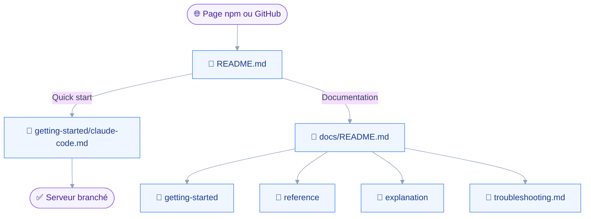
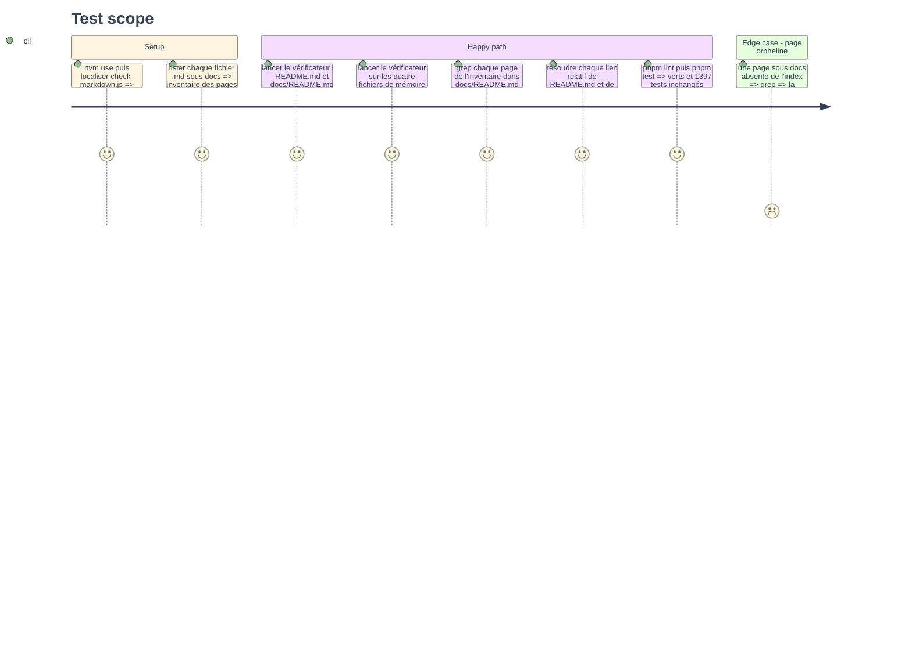

# Instruction — Le README en page d'accueil, l'index et la mémoire

Le README ne peut renvoyer que vers ce qui existe, et tout existe désormais.
Cette phase le réduit à une page d'accueil, écrit l'index de `docs/`, et met la mémoire du projet d'accord avec ce qui vient d'être décidé.

## 🗂️ Architecture projection

> Arbre des fichiers en fin de phase. ✅ créer · ✏️ modifier · ❌ supprimer

```txt
.
├── README.md                                    ✏️
├── CONTRIBUTING.md                              ✏️
├── docs
│   └── README.md                                ✅
└── aidd_docs
    └── memory
        ├── cli.md                               ✏️
        ├── codebase-map.md                      ✏️
        ├── coding-assertions.md                 ✏️
        └── package.md                           ✏️
```

## 🚶 User Journey



## 🧪 Test Scope



## 📝 Tasks to do

### `1)` Le README en page d'accueil

> Ce que c'est, pour qui, comment démarrer, et où lire la suite.

1. Réduire `README.md` à six blocs : une phrase de présentation, les six domaines en une ligne chacun, le quick start Claude Code en une commande, la politique d'écriture en cinq lignes avec le renvoi, la table des liens vers `docs/`, développement et licence.
2. Retirer la table des vingt-neuf outils et la prose par domaine, désormais portées par `docs/reference/tools/`.
3. Retirer la section de configuration au profit d'un lien vers `docs/reference/configuration.md`, en gardant les deux variables obligatoires dans le quick start.
4. Garder le lien vers `CONTRIBUTING.md`, et conserver l'exemption `--ignore=FM001,EMO001` sur le fichier.

### `2)` L'index de la documentation

> Une table par type Diátaxis, chaque page nommée une fois.

1. Créer `docs/README.md` avec quatre tables : mise en route, référence, explication, dépannage, chaque ligne nommant la page et la question à laquelle elle répond.
2. Dire en tête que `docs/` vit sur GitHub et ne part pas sur npm, et que le README y renvoie.

### `3)` Le lien depuis la contribution

> Un contributeur trouve la documentation utilisateur sans passer par le README.

1. Ajouter dans `CONTRIBUTING.md` un renvoi vers `docs/README.md`, à côté de celui vers `aidd_docs/INSTALL.md`.
2. Ajouter la commande du vérificateur avec `--ignore=FM001,EMO001` comme porte à passer sur toute page de `docs/`.

### `4)` La mémoire du projet

> Ce qui a été décidé cette session, écrit là où la prochaine session le lira.

1. `coding-assertions.md` : étendre la section « La vitrine hors contrat » à `docs/**`, avec la même table de règles et la même commande.
2. `cli.md` : retirer la mention du trousseau macOS, qu'aucun code de `src/config/` ne porte, et nommer le fichier `~/.config/jmap-mcp/config.json` à sa place.
3. `codebase-map.md` : ajouter `docs/` à la table des zones, avec sa responsabilité et le fait qu'il n'est pas livré.
4. `package.md` : écrire que `docs/` reste hors du paquet et que le README est la seule vitrine du registre.
5. Passer les quatre fichiers au vérificateur sans `--ignore`, puisqu'ils restent sous le contrat.

### `5)` La vérification

> L'index est complet quand chaque page y figure, et le dépôt reste vert.

1. Lancer le vérificateur sur `README.md` et `docs/README.md` avec l'exemption, et sur les quatre fichiers de mémoire sans.
2. Lister chaque `.md` sous `docs/` et vérifier par grep qu'il est lié depuis `docs/README.md`.
3. Résoudre chaque lien relatif de `README.md` et de `CONTRIBUTING.md`.
4. Lancer `pnpm lint` et `pnpm test` : rien ne lit le README, mais l'assertion vaut mieux que la supposition.

## ✅ Test acceptance criteria

| Task | Acceptance criteria |
| --- | --- |
| 1 | Le README ne porte plus la table des vingt-neuf outils ni la section de configuration, et chaque lien vers `docs/` résout |
| 1 | Le quick start du README suffit à enregistrer le serveur dans Claude Code avec les deux variables obligatoires |
| 2 | Chaque fichier `.md` sous `docs/` est nommé une fois dans `docs/README.md`, et l'index dit que `docs/` ne part pas sur npm |
| 3 | `CONTRIBUTING.md` renvoie vers `docs/README.md` et donne la commande du vérificateur avec son exemption |
| 4 | `cli.md` ne nomme plus le trousseau, `coding-assertions.md` nomme `docs/**` dans l'exemption, et les quatre fichiers passent le vérificateur sans `--ignore` |
| 5 | `pnpm lint` et `pnpm test` restent verts, avec le même nombre de tests qu'avant la phase |
